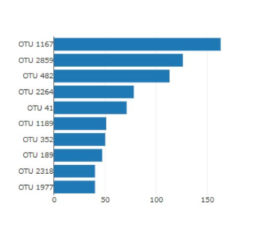

# Kristy Anderson
# Data Analytics
# October 11, 2020
# Plot.ly Challange

# Belly Button Biodiversity

Using Plot.ly, create a horizonatl bar chart of the top 10 OTUs, per individual. Chart must dynamically load based on user selection from dropdown list:

Create bubble chart:

Display metadata:

